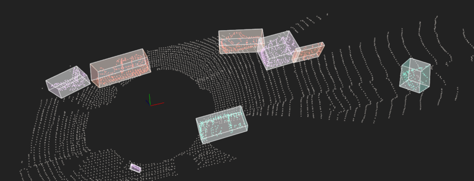

# Sensor Fusion for Self-Driving Cars

**Warning when cloning:** This repository is pretty heavy because the original creators chose to include
Point Cloud Data files at [`src/sensors/data/pcd`](src/sensors/data/pcd); these files sum up to about 342 MB.


## Welcome to the Sensor Fusion for Self-Driving Cars repo.

This repo is about sensor fusion, which is the process of
taking data from multiple sensors and combining it to yield a better
understanding of the world around us. It focuses mostly on two
sensors: [LiDAR](https://en.wikipedia.org/wiki/Lidar), and 
[Radar](https://en.wikipedia.org/wiki/Radar).
Measurements will be fused from these two sensors to track multiple
cars on the road, estimating their positions and speed.

**LiDAR** sensing gives us high resolution data by sending out thousands of
laser signals. These lasers bounce off objects, returning to the sensor where
we can then determine how far away objects are by timing how long it takes
for the signal to return. Also we can tell a little bit about the object
that was hit by measuring the intensity of the returned signal. Each laser
ray is in the infrared spectrum, and is sent out at many different angles,
usually in a 360 degree range. While LiDAR sensors gives us very high
accurate models for the world around us in 3D, they are currently very
expensive, upwards of $60,000 for a standard unit.

**Radar** data is typically very sparse and in a limited range, however it
can directly tell us how fast an object is moving in a certain direction.
This ability makes radars a very practical sensor for doing things like
cruise control where its important to know how fast the car in ront of you
is traveling. Radar sensors are also very affordable and common now of days
in newer cars.

**Sensor Fusion** by combing LiDAR's high resolution imaging with radar's
ability to measure velocity of objects we can get a better understanding
of the surrounding environment than we could using one of the sensors alone.

## Building the project

This project requires [PCL](https://pointcloudlibrary.github.io/). On a
Ubuntu-like system, you should be able to install the PCL development
sources like so:

```bash
sudo apt install libpcl-dev
```

The project itself uses CMake. To build, follow the typical CMake pattern:

```bash
mkdir build && cd build
cmake ..
make
```

You can then run the simulator from the `environment` binary:

```bash
cd ..
build/environment
```

Note that the project contains hard-coded paths (yes, I know ...)
to the PCD files, so running it from the repo's root directory is crucial.

## A Simple Highway

Initially, the simulated LiDAR sensor was updated to have a higher
horizontal and vertical resolution, as well as some measurement noise.
In this setup, we have:

- Distance range of 5 .. 50 m.
- Distance noise of zero mean, 0.2 m standard deviation.
- Field of view of -30.0° .. 26°.
- Eight laser layers (i.e. 7° vertical resolution).
- Angle increments of π/64 (i.e. 2.8125° horizontal resolution).

Here's how it looks like:


I also took the liberty to tune the colors a bit, because the original
visualization was just horrible on the eyes. Some things are just not negotiable.

Using a sample consensus approach (specifically, RANSAC) the obtained
point cloud was then separated into two plane and obstacle clodus
using a planar model.


In here, red points represent obstacles, while white points represent
the plane. Note that in the video, the sensor noise was reduced a bit
to improve the visual appearance.

A Kd-tree backed Euclidean cluster extraction was added to tell the separate
cars apart. In here, we're making use of the fact that the ground plane
already is separated from the rest; only having to look at the outliers
drastically simplifies the process.


Using PCL's `pcl::getMinMax3D()` function, the extends of the segmented
clusters are determined and used to provide axis-aligned bounding boxes.


Principal component analysis can be used to determine the orientation of
the point cloud. Some assumptions about the valid transformations have
to be made here: If full 3D pose is allowed, the produced bounding boxes
are optimal, but very unlikely four ground-bound vehicles such as cars.
However, if the anticipated objects can be freely aligned in space,
this may even be required.
In either case, axis-aligned bounding boxes can be used for broadphase
collision/intersection checking before more fine-grained, but
computationally more expensive tests are executed. 


Limiting the PCA to only observe the X and Y components, we can generate
bounding boxes that are oriented on the Z plane, but axis aligned with
XY and YZ.


## Real Point Clouds

So far, only a virtual environment was sampled using a virtual LiDAR.
To step it up, real point-cloud data taken from an actual car driving
in traffic was loaded from a PCD file.


After subsampling the point cloud using voxels of 0.2 m edge length,
as well as reducing the field of view to only include some 30 m ahead,
10 m behin, 7 m left and 5 m right of the ego car, the above techniques
were applied again, producing in the following outcome:



Note that the bounding boxes are oriented on the Z plane again and that
one truck was artificially split into two clusters.

A result with axis-aligned bounding boxes (they look much better
than untreated oriented BBs, to be fair) can be found at the top of this
README.
